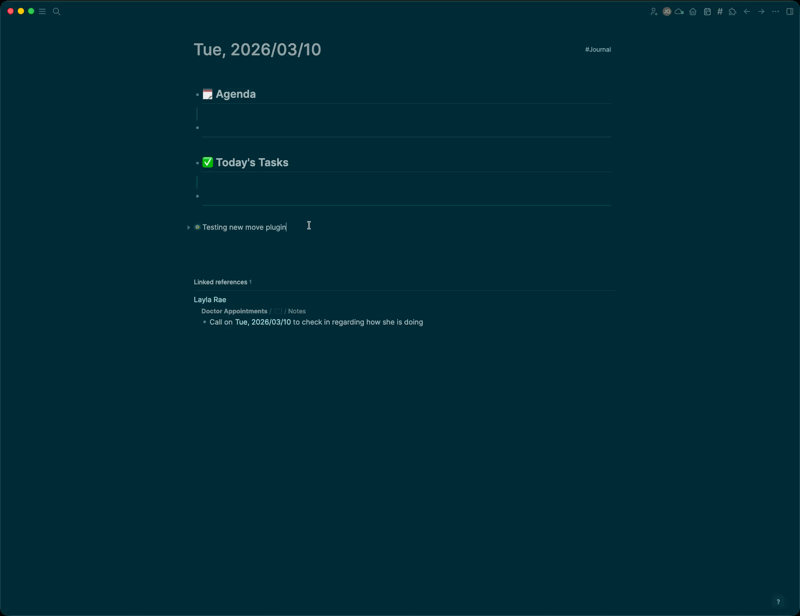
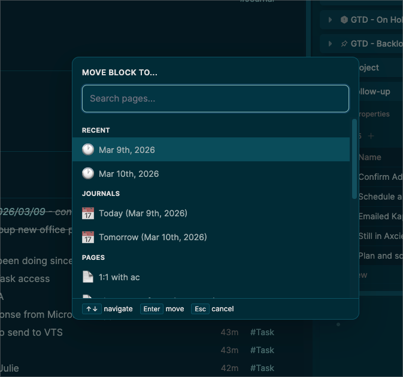
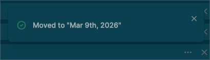
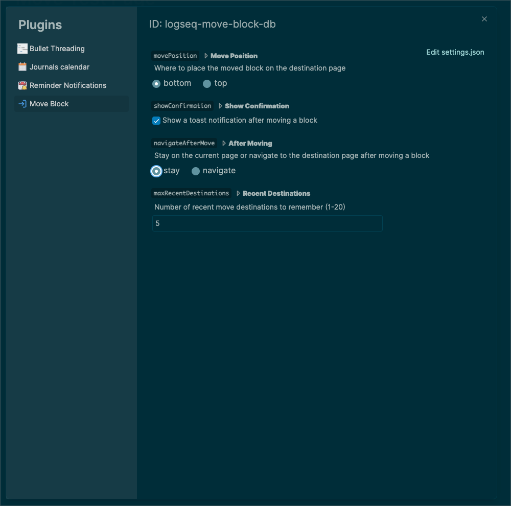

# Move Block (Database)

> **Workflowy-style "Move To" for Logseq Database graphs.**
> Move blocks (with all children) to any page or journal day via slash commands, keyboard shortcut, or context menu.





---

## Feature Pack

| Feature | Details |
| --- | --- |
| `/move` | Unified search modal to pick any page or journal |
| `/move to page` | Search modal filtered to pages only |
| `/move to today` | Instant move to today's journal page |
| `/move to journal` | Search modal filtered to journal pages |
| `Cmd+Shift+M` | Keyboard shortcut (Mac) / `Ctrl+Shift+M` (Windows/Linux) |
| Right-click menu | "Move to..." context menu on any block |
| Full tree move | Block and all nested children move together |
| Auto-collapse | Moved blocks with children are collapsed at the destination |
| Property preservation | Block properties are copied to the destination |
| Recent destinations | Quick access to your last move targets |
| Navigate after move | Optionally open the destination page after moving |

---

## Compatibility

| Supported | Not Supported |
| --- | --- |
| Logseq Desktop (macOS, Windows, Linux) with DB graphs | Logseq Mobile |
| Slash commands, keyboard shortcut, context menu | File-based/Markdown graphs |
| | Logseq web version |

---

## Quick Start

### 1. Installation

**Option A: Logseq Marketplace** (coming soon)
- Open Logseq > `Settings > Plugins > Marketplace`
- Search for "Move Block"

**Option B: Clone from GitHub**
```bash
git clone https://github.com/Joemnewton/logseq-move-block-db.git
```

**Option C: Download ZIP**
- Download from the [GitHub repository](https://github.com/Joemnewton/logseq-move-block-db)

### 2. Load in Logseq
1. Open Logseq
2. Go to `Settings > Plugins`
3. Click `Load unpacked plugin`
4. Select the plugin folder

### 3. Remove Built-in Move Keymap (Recommended)

Logseq has a built-in `Move blocks` shortcut (`Cmd+Shift+M`) that conflicts with this plugin. The built-in move does not work in DB graphs, so it's safe to remove:

1. Go to `Settings > Keymap`
2. Search for **"Move blocks"** (under `editor/move-blocks`)
3. Click the shortcut and press **Backspace** to unset it
4. Restart Logseq

> **Note:** If you skip this step, the keyboard shortcut `Cmd+Shift+M` may not work. The slash commands and context menu will still work fine.

---

## Usage

### Move via slash command
1. Place your cursor in the block you want to move
2. Type `/move` (or `/move to page`, `/move to today`, `/move to journal`)
3. A search modal appears - type to filter pages
4. Use arrow keys to navigate, Enter to select
5. Block (and all children) moves to the selected page

### Move via keyboard shortcut
1. Place your cursor in the block
2. Press `Cmd+Shift+M` (Mac) or `Ctrl+Shift+M` (Windows/Linux)
3. Select destination in the modal

### Move via context menu
1. Right-click on any block
2. Select "Move to..."
3. Select destination in the modal



---

## Settings

Access via `Settings > Plugins > Move Block`

| Setting | Description | Default |
| --- | --- | --- |
| **Move Position** | Where to place the block on the destination page (top or bottom) | `bottom` |
| **Show Confirmation** | Show a toast after moving | `true` |
| **After Moving** | Stay on current page or navigate to the destination page | `stay` |
| **Recent Destinations** | How many recent destinations to remember (1-20) | `5` |



---

## Troubleshooting

### Block not moving?
- Make sure your cursor is inside a block before using the command
- Check the Developer Console (`Cmd+Opt+I`) for error messages

### Keyboard shortcut not working?
- Remove the built-in `Move blocks` keymap (see [Quick Start](#3-remove-built-in-move-keymap-recommended) above)
- Try the slash command `/move` as an alternative

### Modal not appearing?
- Try the keyboard shortcut `Cmd+Shift+M` instead
- Restart the plugin via `Settings > Plugins`

### Properties not copying?
- Some internal properties (like `id`, `uuid`) are intentionally skipped
- Custom properties should transfer correctly

---

## Development

- **Target**: Logseq Desktop DB version
- **Architecture**: Single file (`index.js`), no bundler, zero dependencies
- **API**: Uses `logseq.Editor.*` methods for block operations

---

## License

MIT

---

## Links

- **GitHub**: [logseq-move-block-db](https://github.com/Joemnewton/logseq-move-block-db)
- **Issue Tracker**: [Report bugs or request features](https://github.com/Joemnewton/logseq-move-block-db/issues)

---

*Made for the Logseq community*
